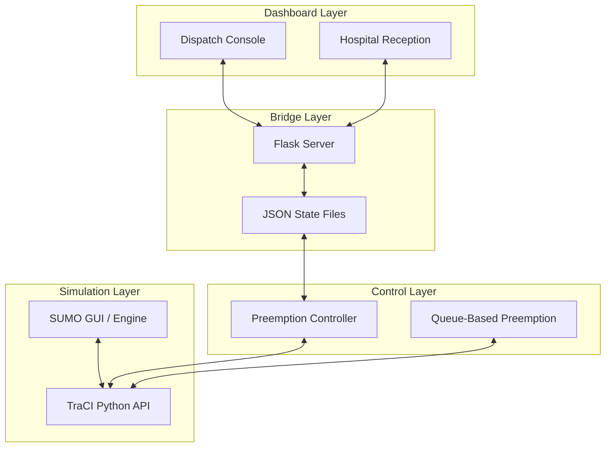

# AGWPS — Adaptive Green Wave Pre-emption System

**AGWPS** (Adaptive Green Wave Pre-emption System) is a simulation-driven intelligent transportation system designed to optimize emergency vehicle (ambulance) routing and traffic signal preemption. Leveraging the Eclipse SUMO (Simulation of Urban MObility) framework and TraCI, AGWPS dynamically alters traffic signals to establish a "Green Wave" corridor, clearing intersections in advance of a responding ambulance and reverting signals once the vehicle has safely crossed.

---

## 🌟 Key Features & Provisions

### 1. Dynamic Traffic Preemption Algorithms
AGWPS evaluates and provides multiple preemption mechanisms, showing a progression from baseline strategies to a unified proposed model:
*   **Methodology 1 — Fixed-Distance Preemption (Baseline):** Activates green lights and safety yellow warnings at static predefined ranges (e.g., 50m to 80m). While reliable in light traffic, it does not adapt to queues.
*   **Methodology 2 — Queue-Based Preemption:** Dynamically extends trigger ranges based on halting vehicle counts to allow queues to discharge. The base formula is:
    $$D_{\text{trigger}} = D_{\text{base}} + (N_{\text{vehicles}} \times D_{\text{buffer}})$$
*   **Combined Proposed Method — Extended Corridor Preemption with Adaptive Queue Discharge:** Consolidates and enhances the two previous methodologies into a single unified controller. It combines a **500m lookahead window** (allowing multi-intersection rolling green waves) with a physics-based **Queue Discharge Time (QDT)** model. 
    
    This unified method uses the following new formula:
    $$T_{\text{gqd}} = (n_{\text{stopped}} \times h_{\text{sat}}) + T_{\text{startup}}$$
    $$D_{\text{trigger}} = V_{EV} \times T_{\text{gqd}} \times SF$$
    *   $T_{\text{gqd}}$ is the estimated time needed to clear the queue in front of the ambulance.
    *   $D_{\text{trigger}}$ is the dynamic distance threshold where the green phase must begin, adapting in real time to the ambulance's velocity ($V_{EV}$) and queue size.

*   **Safety Transitions:** Conflicting signal phases transition to yellow (e.g., within 50m of the trigger boundary) to warn drivers mid-intersection before the green phase forces lock.
*   **Delayed Release & Recovery:** Reverts to standard traffic light cycles only after a safety delay (e.g., 4 seconds) to ensure the vehicle has fully crossed.


### 2. Live Interactive Web Dashboard
A polished, dark-themed dashboard is provided via [agwps_dashboard_merged__1_.html](file:///d:/greenwave/agwps_dashboard_merged__1_.html):
*   **Dispatch Console:** Allows coordinators to submit new emergency incidents. You can select the dispatch ID, starting intersection (e.g., `INT-11`), destination hospital, patient injury severity level (`Minor`, `Medium`, `Serious`, `Critical`), and scenario.
*   **Real-time Analytics:** Displays system metrics including:
    *   **Active Calls:** Count of currently responding ambulances.
    *   **Queue Cleared Rate:** Percentage of successful runs.
    *   **Average ETA:** Live-updated expectation.
    *   **Completed Incident Log:** History of dispatched and completed responses.
*   **Hospital Reception / Monitor:** A live view for receiving hospitals displaying ETA to the ER, distance remaining, route progress (progress bar), current next intersection, and patient priority warnings.

### 3. Smart Dynamic Routing
*   **Dynamic Shortest-Path Calculation:** When a vehicle is dispatched from the dashboard, `sumo_runner.py` reads the request, maps the origin and destination to nodes, and calls `traci.simulation.findRoute` to dynamically query the fastest path through the SUMO network, falling back to a pre-defined route if the lookup fails.

### 4. Robust Real-Time Data Bridge
*   **Flask Server Bridge (`server.py`):** Connects the backend simulation to the web frontend using thread-safe state synchronization and low-overhead JSON polling files (`pending_dispatch.json`, `hospital_view.json`, `sumo_output.json`).
*   **Auto-Cleanup & TTL:** Removes completed ambulance tracking records after a configurable Time-To-Live (TTL) to keep the dashboard clean.
---

## 🔬 Project Methodology

This project is structured around the design, simulation, and analysis of adaptive preemption strategies within a microscopic traffic environment. Below is the methodology of the implemented system:

### 1. System Architecture
The system consists of four primary integrated layers:
*   **Simulation Layer (SUMO + TraCI):** Manages the physical network, runs vehicle physics, coordinates traffic light signals, and simulates background traffic.
*   **Bridge Layer (Flask Server + JSON Data Bridge):** Handles background synchronization, parses the simulation state, and acts as the API endpoint broker between the user interface and SUMO.
*   **Control Layer (Preemption Algorithms):** Implemented in Python, this layer dynamically Queries the simulation state via TraCI and forces traffic signals to override their normal cycles.
*   **Dashboard Layer (Web Interface):** A responsive frontend for dispatching incidents and monitoring ambulance status (ETA, distance, next junction) in real-time.



### 2. Network & Traffic Setup
*   **Road Network:** A $4 \times 4$ grid containing 16 signalized intersections labeled `A0` through `D3` in a row-column naming format. Lane dimensions, junction parameters, and speed limits follow standard urban road specifications.
*   **Background Traffic:** Stochastically generated using the SUMO `randomTrips.py` utility. Vehicles depart at an average rate of 2.5 vehicles per second with a fringe-factor of 10 to bias travel towards the network margins, creating realistic arterial flows. Approximately 9,000 passenger vehicles are simulated over a 3,600-second window.

### 3. Ambulance Route Configuration
*   **Vehicle Specifications:** The ambulance (`AMB-001`) is configured with the `emergency` vehicle class in SUMO (GUI shape, high acceleration/deceleration parameters: $2.6\,\text{m/s}^2$ accel, $4.5\,\text{m/s}^2$ decel, max speed $16.7\,\text{m/s}$ or $60\,\text{km/h}$).
*   **Route:** The vehicle runs a diagonal path traversing from the bottom-left to the top-right corner:
    $$\text{A0B0} \rightarrow \text{B0B1} \rightarrow \text{B1C1} \rightarrow \text{C1C2} \rightarrow \text{C2D2} \rightarrow \text{D2D3}$$
    This route crosses six signalized intersections: `B0`, `B1`, `C1`, `C2`, `D2`, and `D3`.
*   **Spawn Offset:** Spawns at simulation step 250 to allow background traffic to build up realistic queues at intersections.

### 4. Preemption & Queue Discharge Logic
The system implements a progression of preemption strategies, culminating in a combined proposed model:
*   **Methodology 1 — Fixed-Distance Preemption:** A static trigger distance (typically 50m to 80m). Activates green lights and triggers yellow safety phases at set distances regardless of congestion.
*   **Methodology 2 — Queue-Based Preemption:** Uses real-time vehicle halts to scale trigger distance linearly, allowing standing queues to discharge.
*   **Combined Proposed Method — Extended Corridor Preemption with Adaptive Queue Discharge:** 
    A novel consolidation of the two previous methodologies. It extends the lookahead window to a **500-meter corridor** (allowing coordination across multiple consecutive junctions simultaneously) and embeds a physics-based **Queue Discharge Time (QDT)** model. 
    
    The Queue Discharge Time ($T_{gqd}$) is calculated as:
    $$T_{gqd} = (n_{\text{stopped}} \times h_{\text{sat}}) + T_{\text{startup}}$$
    *   $n_{\text{stopped}}$: Number of stopped vehicles in the ambulance's path lane.
    *   $h_{\text{sat}}$: Saturation headway (average time spacing between vehicles passing the intersection green line, e.g., 2.0s).
    *   $T_{\text{startup}}$: Startup reaction delay.
    
    The dynamic trigger distance ($D_{\text{trigger}}$) is calculated using the ambulance's speed ($V_{EV}$) and a safety factor ($SF = 1.5$):
    $$D_{\text{trigger}} = V_{EV} \times T_{gqd} \times SF$$
    
    *   **Activation:** The signal is forced green when the ambulance enters $D_{\text{trigger}}$ (clamped between 30m and 450m) or when its live ETA is less than $T_{gqd} + 2\,\text{seconds}$.
    *   **Pre-Warning Transition:** Intersections within $D_{\text{trigger}} + 50\,\text{meters}$ transition conflicting green phases to yellow to allow cross-traffic to safely clear the junction.
    *   **Reversion:** Once the ambulance exits the intersection approach, the controller restores the original signal program (`traci.trafficlight.setProgram(tls, '0')`).


---


## 📁 Repository Structure

```
greenwave/
├── config/
│   └── simulation.sumocfg        # SUMO simulation configuration file
├── network/
│   ├── grid.net.xml              # SUMO road network (4x4 or grid layout)
│   ├── grid.rou.xml              # Background traffic routes and vehicles
│   └── generate_traffic.py       # Script using SUMO randomTrips to generate traffic
├── ambulance/
│   ├── ambulance.rou.xml         # XML definition of the ambulance vehicle type and route
│   └── create_ambulance.py       # Helper script to generate ambulance XML routes
├── controller/
│   ├── preemption.py             # Preemption strategies (Fixed 50m, Brute Force, Safety Transitions)
│   ├── queuepreemption.py        # Queue-based autonomous preemption logic
│   ├── dashboard.py              # Backup Streamlit-based dashboard configuration
│   ├── verify_network.py         # Diagnostic utility to verify SUMO network loading & TLS phases
│   └── verify_ambulance.py       # Baseline analysis script measuring run-times without preemption
├── server.py                     # Flask web server bridging frontend dashboard and simulation
├── sumo_runner.py                # Main simulation runner executing loop, routing, and preemption
├── agwps_dashboard_merged__1_.html  # Polished interactive dashboard frontend (HTML/CSS/JS)
├── preempt_log.txt               # Debug log tracking forced signals and release steps
└── *.json                        # Real-time state exchange files (completed_runs, hospital_view, etc.)
```

---

## 🛠️ Installation & Setup

### Prerequisites
1.  **Python 3.8+**
2.  **SUMO (Simulation of Urban MObility):** Ensure SUMO is installed on your system.
3.  **Environment Variable:** Set the `SUMO_HOME` environment variable to your SUMO installation folder (e.g., `C:\Program Files (x86)\Eclipse\Sumo`).

### Dependencies Installation
Install the required Python packages using pip:
```bash
pip install Flask sumolib traci
```
*(Optional: Install `streamlit` if you wish to run the backup Streamlit dashboard).*

---

## 🚀 Running the System

To run the full integrated system with the interactive dashboard:

### Step 1: Start the Web Server
Launch the Flask backend server. It serves the dashboard and manages communication files.
```bash
python server.py
```
*   The dashboard will be accessible at: **[http://localhost:5000](http://localhost:5000)**

### Step 2: Start the Simulation Runner
In a separate terminal, launch the main SUMO runner:
```bash
python sumo_runner.py
```
*   This will initialize the SUMO GUI and start the simulation loop. It will scale background traffic and listen for dispatch actions.

### Step 3: Dispatch an Incident
1.  Open **[http://localhost:5000](http://localhost:5000)** in your web browser.
2.  Navigate to the **Dispatch New Run** tab.
3.  Fill out the dispatch details (e.g., select start intersection `INT-11`, destination `City Hospital`, injury level `Critical`).
4.  Click **Dispatch Ambulance**.
5.  Watch the SUMO GUI: a red ambulance will spawn at your origin node and traverse the grid network.
6.  The signals along the route will dynamically cycle to Green, clearing traffic ahead.
7.  The **Hospital Reception** tab on the web dashboard will display live progress, remaining distance, and ETA.

---

## ⚙️ Development & Diagnostics Utilities

*   **Generate Random Background Traffic:**
    If you want to regenerate traffic patterns on the grid network:
    ```bash
    python network/generate_traffic.py
    ```
*   **Verify SUMO Network Installation:**
    Verify if SUMO loads the configuration correctly and check signal operations:
    ```bash
    python controller/verify_network.py
    ```
*   **Run Baseline Run (No Preemption):**
    Measures the baseline vehicle travel time to calculate expected route travel times (EVRT):
    ```bash
    python controller/verify_ambulance.py
    ```
*   **Run Standalone Queue-Based Preemption:**
    To test the queue-based algorithm locally without the web server/dashboard:
    ```bash
    python controller/queuepreemption.py
    ```
